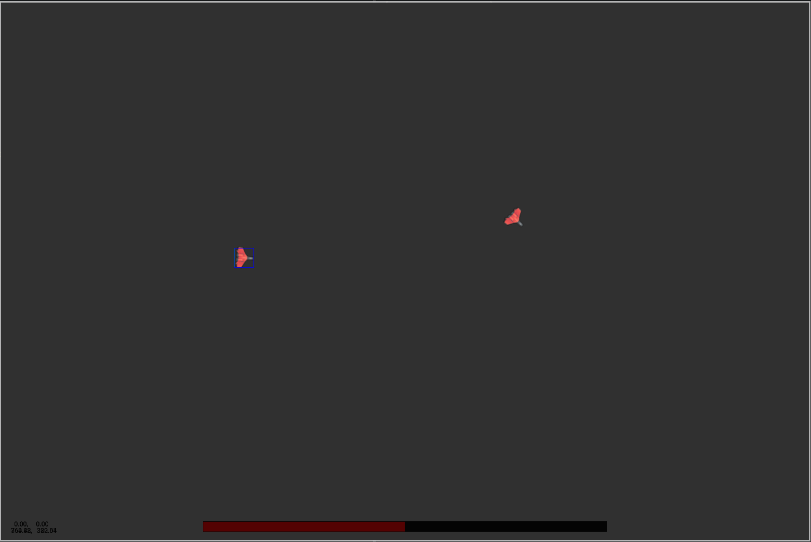

# Spacemen :rocket:

Game about men in space



# Controls

```
W: Accelerate forward
A: Rotate left
D: Rotate Right
S: Brake

Space: Fire

F2: Open Editor
F3: Debug Toggle
```
# TODO

- Add powerup support to networking
- Add more power ups
- Add more particle effects
- Add audio support
- Add server settings
- Add client-side prediction
- Add jitter compensation
- Test and Build Mac version
